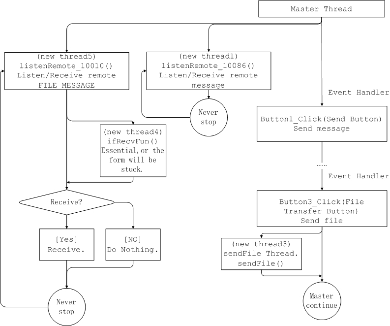
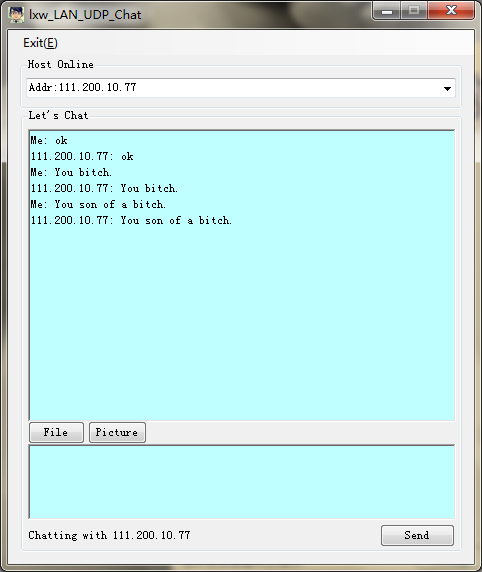

lxw_Udp_Chat
============

LAN chat and file transfer 
<strong>From my point of view</strong>, the LAN Chatting implemented with <strong>UDP</strong> is much much more complicated than implemented with <strong>TCP</strong>. 
I implemented it with TCP in <strong>Python</strong> a couple of days ago. It's much easier and convenient. 
 

The main framwork of my program is shown in the following picture. 
* 

 
The window of the program is like this: 

* 
