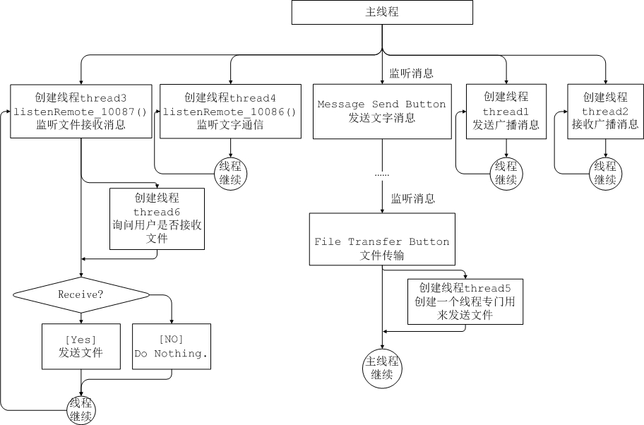

lxw_Udp_Chat
============

LAN chat and file transfer
From my point of view, the LAN Chatting implemented with UDP is much much more complicated than implemented with TCP.
I implemented it with TCP in Python a couple of days ago. It's much easier and convenient.

The main framwork of my program is shown in the following picture.
* 

The window of the program is like this: 

* 
